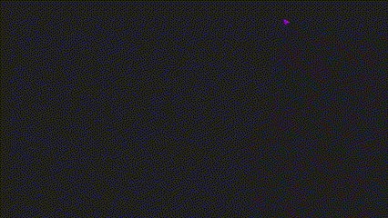

# Boundless-Board

Boundless Board id an endless TicTacToe game against an AI.
This project deemed to learn Unity's Canvas and UI technology to improve UI & UX design for future projects.
It makes great use of the DOTween plugin to create some simple but eyecatching UI animations similar to the use of CSS.
The game has been developed in less than two days.

>

